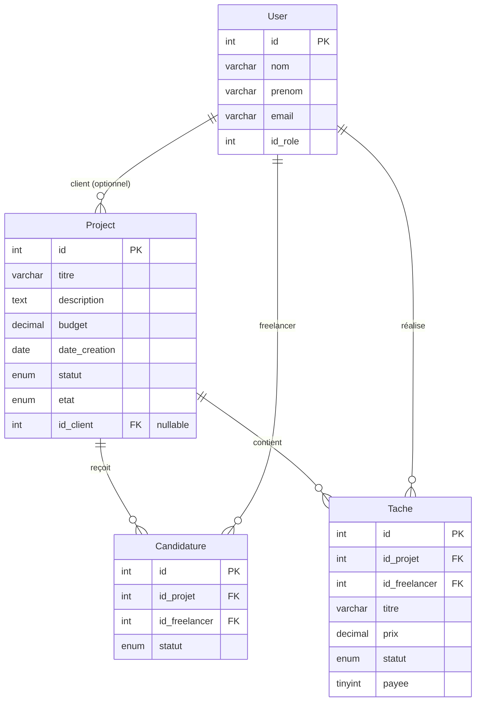
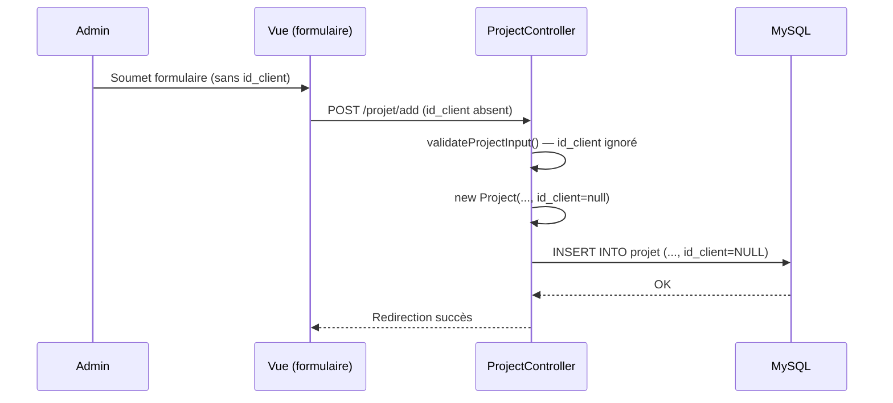
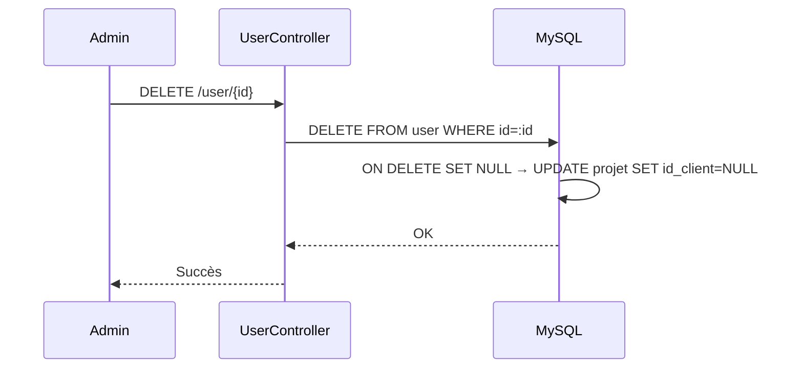

# Document de Conception — project-user-independence

## Vue d'ensemble

Cette fonctionnalité découple les projets SkillBridge de la notion d'utilisateur client. Actuellement, la colonne `id_client` de la table `projet` est supposée non nulle dans plusieurs requêtes SQL et dans la logique métier des contrôleurs. L'objectif est de rendre `id_client` pleinement optionnel (nullable) à tous les niveaux : schéma de base de données, modèle PHP, contrôleurs, vues et export PDF.

Les changements sont rétrocompatibles : les projets existants avec un client conservent leur association. Seule la contrainte d'obligation est levée.

---

## Architecture

L'application suit un pattern MVC PHP sans framework :

```
index.php (routeur frontal)
    ├── Controllers/
    │   ├── ProjectController.php   ← CRUD projets + stats + export PDF
    │   ├── CandidatureController.php ← candidatures, tâches, paiements
    │   └── UserController.php      ← CRUD utilisateurs + suppression
    ├── Models/
    │   ├── Project.php             ← entité projet (id_client déjà nullable)
    │   ├── Candidature.php
    │   ├── Tache.php
    │   └── User.php
    └── Views/
        ├── Backoffice/             ← vues admin
        └── Frontoffice/            ← vues publiques
```

La base de données MySQL contient la table `projet` avec la colonne `id_client INT DEFAULT NULL` (ajoutée par `alter_projet.sql`). La contrainte de clé étrangère avec `ON DELETE SET NULL` doit être ajoutée.



---

## Composants et interfaces

### 1. Migration SQL

Un script de migration ajoute la contrainte FK avec `ON DELETE SET NULL` sur `id_client` :

```sql
-- Ajouter la contrainte FK avec ON DELETE SET NULL
ALTER TABLE `projet`
  ADD CONSTRAINT `fk_projet_client`
  FOREIGN KEY (`id_client`) REFERENCES `user`(`id`)
  ON DELETE SET NULL
  ON UPDATE CASCADE;
```

Si la contrainte existe déjà sans `ON DELETE SET NULL`, il faut la supprimer puis la recréer.

### 2. ProjectController — méthodes modifiées

| Méthode | Changement requis |
|---|---|
| `addProject()` | Déjà correct — passe `id_client` nullable. Ajouter validation optionnelle de l'existence du client si `id_client` fourni. |
| `updateProject()` | Ajouter `id_client` dans le `UPDATE` SQL pour permettre la mise à jour (actuellement absent de la requête UPDATE). |
| `listAllProjects()` | Déjà correct — utilise `LEFT JOIN`. Vérifier que `nom_client` affiche « — » quand NULL. |
| `listProjects()` | Déjà correct — ne filtre pas sur `id_client`. |
| `exportProjectsPdf()` | Ajouter le champ client dans les lignes exportées, avec fallback « Non assigné ». |
| `getStats()` | Déjà correct — ne filtre pas sur `id_client`. |
| `validateProjectInput()` | `id_client` n'est pas dans la validation — correct, il reste optionnel. |

**Signature de `updateProject()` après modification :**

```php
public function updateProject(Project $project)
{
    $sql = "UPDATE projet SET titre=:titre, description=:description, budget=:budget,
            date_creation=:date_creation, statut=:statut, id_client=:id_client WHERE id=:id";
    // ...
    $query->execute([
        // ...
        'id_client' => $project->getIdClient(), // NULL autorisé
        'id'        => $project->getId(),
    ]);
}
```

### 3. CandidatureController — méthodes modifiées

| Méthode | Changement requis |
|---|---|
| `postuler()` | Aucun — ne vérifie pas `id_client`. |
| `getMesCandidatures()` | Aucun — JOIN sur `projet`, pas sur `user`. |
| `getAllCandidatures()` | Aucun — JOIN sur `projet` et `user` (freelancer), pas sur le client. |
| `changerStatut()` | Aucun — met à jour `projet.statut` sans condition sur `id_client`. |
| `getProjetsAcceptes()` | Déjà correct — utilise `LEFT JOIN user` pour le client. |
| `ajouterTache()` | Aucun — vérifie candidature acceptée, pas `id_client`. |
| `getBudgetRestant()` | Aucun — calcul basé sur `budget` et `tache.prix`. |
| `payerTache()` | **Modifier** — la vérification `p.id_client = :c` doit être séparée selon le rôle de l'acteur (admin vs client). |
| `verifierEtTerminerProjet()` | Aucun — basé sur `avancement` et statuts des tâches. |

**Nouvelle logique de `payerTache()` :**

```php
public function payerTache($id_tache, $id_acteur, $role_acteur = 'client')
{
    // Récupérer la tâche avec son projet
    $q = $db->prepare("SELECT t.id, t.statut, t.payee, t.prix, p.id_client
        FROM tache t JOIN projet p ON p.id = t.id_projet
        WHERE t.id = :id");
    $q->execute(['id' => $id_tache]);
    $tache = $q->fetch();

    if (!$tache) return ['success' => false, 'message' => 'Tâche introuvable.'];
    if ($tache['statut'] !== 'termine') return ['success' => false, 'message' => 'La tâche doit être terminée.'];
    if ($tache['payee']) return ['success' => false, 'message' => 'Déjà payée.'];

    // Vérification d'autorisation selon le rôle
    if ($role_acteur === 'client') {
        if ($tache['id_client'] === null) {
            return ['success' => false, 'message' => 'Ce projet n\'a pas de client associé. Contactez un administrateur.'];
        }
        if ((int)$tache['id_client'] !== (int)$id_acteur) {
            return ['success' => false, 'message' => 'Accès refusé.'];
        }
    }
    // Admin : pas de vérification d'appartenance

    $q = $db->prepare("UPDATE tache SET payee=1 WHERE id=:id");
    $q->execute(['id' => $id_tache]);
    return ['success' => true, 'message' => 'Paiement effectué.', 'prix' => (float)$tache['prix']];
}
```

### 4. UserController — méthode `deleteUser()`

Deux approches pour l'intégrité référentielle :

**Option A (recommandée) — Contrainte FK `ON DELETE SET NULL` en base :**
La suppression de l'utilisateur déclenche automatiquement `SET NULL` sur `projet.id_client`. Aucune modification du contrôleur nécessaire.

**Option B — Logique applicative dans `deleteUser()` :**
```php
public function deleteUser($id)
{
    $db = Config::getConnexion();
    // Dissocier les projets avant suppression
    $q = $db->prepare("UPDATE projet SET id_client = NULL WHERE id_client = :id");
    $q->execute(['id' => $id]);
    // Puis supprimer l'utilisateur
    $q = $db->prepare("DELETE FROM user WHERE id = :id");
    $q->execute(['id' => $id]);
    return true;
}
```

L'Option A est préférée car elle garantit l'intégrité même en cas d'accès direct à la base. L'Option B est un filet de sécurité supplémentaire.

### 5. Vues — affichage du client

Dans toutes les vues back-office affichant le nom du client :

```php
// Avant
echo $project->getNomClient();

// Après
$nomClient = trim($project->getNomClient());
echo ($nomClient !== '') ? htmlspecialchars($nomClient) : '—';
```

### 6. Export PDF — champ client

Dans `exportProjectsPdf()` :

```php
$nomClient = trim($project->getNomClient());
$clientLabel = ($nomClient !== '') ? $nomClient : 'Non assigné';
$lines[] = sprintf('#%d | %s | Client: %s | Budget: %.2f TND | Statut: %s',
    $project->getId(), $project->getTitre(), $clientLabel,
    (float)$project->getBudget(), $project->getStatut());
```

---

## Modèles de données

### Table `projet` — état cible

```sql
CREATE TABLE `projet` (
  `id`            int(11)      NOT NULL AUTO_INCREMENT,
  `titre`         varchar(150) NOT NULL,
  `description`   text         NOT NULL,
  `budget`        decimal(10,2) NOT NULL DEFAULT 0.00,
  `date_creation` date         NOT NULL,
  `statut`        enum('en_cours','termine','en_attente') NOT NULL DEFAULT 'en_attente',
  `etat`          enum('en_attente_validation','publie','refuse') NOT NULL DEFAULT 'en_attente_validation',
  `id_client`     int(11)      DEFAULT NULL,              -- nullable, optionnel
  `avancement`    int(3)       NOT NULL DEFAULT 0,
  `created_at`    timestamp    NOT NULL DEFAULT current_timestamp(),
  PRIMARY KEY (`id`),
  CONSTRAINT `fk_projet_client`
    FOREIGN KEY (`id_client`) REFERENCES `user`(`id`)
    ON DELETE SET NULL
    ON UPDATE CASCADE
) ENGINE=InnoDB DEFAULT CHARSET=utf8mb4;
```

### Classe `Project` (PHP)

La classe `Project` est déjà correcte : `$id_client` est initialisé à `null` par défaut dans le constructeur. Aucune modification du modèle n'est nécessaire.

### Flux de données — création de projet sans client



### Flux de données — suppression d'un client



---

## Propriétés de correction

*Une propriété est une caractéristique ou un comportement qui doit être vrai pour toutes les exécutions valides d'un système — essentiellement, un énoncé formel de ce que le système doit faire. Les propriétés servent de pont entre les spécifications lisibles par l'humain et les garanties de correction vérifiables par machine.*

### Propriété 1 : Création de projet sans client — round-trip

*Pour tout* ensemble de données de projet valides (titre, description, budget, date_creation, statut) sans `id_client`, appeler `addProject()` puis récupérer le projet par son ID doit retourner un projet avec `id_client = NULL`.

**Valide : Requirements 1.1, 1.2**

---

### Propriété 2 : Validation des champs indépendante de id_client

*Pour tout* ensemble de données de projet avec des valeurs valides ou invalides pour `titre`, `description`, `budget`, `date_creation` et `statut`, le résultat de `validateProjectInput()` doit être identique que `id_client` soit présent, absent ou nul.

**Valide : Requirements 1.4, 3.4**

---

### Propriété 3 : Complétude du listage back-office

*Pour tout* ensemble de projets insérés en base (certains avec `id_client`, d'autres avec `id_client = NULL`), `listAllProjects()` doit retourner exactement tous ces projets sans en omettre aucun.

**Valide : Requirements 2.1, 2.4**

---

### Propriété 4 : Affichage du client absent

*Pour tout* projet dont `id_client` est NULL, `getNomClient()` doit retourner une chaîne vide ou nulle, et la couche de présentation doit afficher le texte de substitution (« — » ou « Non assigné »).

**Valide : Requirements 2.2, 8.3**

---

### Propriété 5 : Mise à jour de projet sans client — round-trip

*Pour tout* projet existant, appeler `updateProject()` avec `id_client = NULL` puis récupérer le projet doit retourner un projet avec `id_client = NULL` et les autres champs mis à jour correctement.

**Valide : Requirements 3.1, 3.2**

---

### Propriété 6 : Candidature sur projet sans client

*Pour tout* projet dont `id_client` est NULL et tout freelancer valide, `postuler()` doit enregistrer la candidature avec succès et `getAllCandidatures()` doit la retourner.

**Valide : Requirements 4.1, 4.2**

---

### Propriété 7 : Transition de statut indépendante de id_client

*Pour tout* projet (avec ou sans `id_client`), accepter une candidature via `changerStatut('accepte')` doit passer le statut du projet à `en_cours`, et compléter toutes les tâches avec avancement à 100 doit passer le statut à `termine`.

**Valide : Requirements 4.3, 5.3**

---

### Propriété 8 : Calcul du budget restant indépendant de id_client

*Pour tout* projet dont `id_client` est NULL et toute liste de tâches associées, `getBudgetRestant()` doit retourner `budget - sum(tache.prix)` correctement, identique au résultat pour un projet avec client.

**Valide : Requirements 5.2**

---

### Propriété 9 : Autorisation de paiement selon le rôle et id_client

*Pour tout* client et toute tâche terminée non payée, `payerTache()` doit réussir si et seulement si `projet.id_client = id_client_acteur`. Si `id_client` est NULL, le paiement par un client doit être refusé avec un message explicite. Un admin peut toujours payer une tâche terminée non payée, quelle que soit la valeur de `id_client`.

**Valide : Requirements 6.1, 6.2, 6.3, 6.4**

---

### Propriété 10 : Intégrité référentielle à la suppression d'un utilisateur

*Pour tout* utilisateur client associé à N projets, après suppression de cet utilisateur, les N projets doivent toujours exister en base avec `id_client = NULL`, et toutes leurs candidatures et tâches doivent être préservées.

**Valide : Requirements 7.1, 7.2**

---

### Propriété 11 : Complétude de l'export et des statistiques

*Pour tout* ensemble de projets (avec ou sans `id_client`), `getStats()` doit comptabiliser tous les projets dans son total, et `exportProjectsPdf()` doit inclure tous les projets avec « Non assigné » pour ceux sans client.

**Valide : Requirements 8.1, 8.2, 8.3**

---

## Gestion des erreurs

| Scénario | Comportement attendu |
|---|---|
| `id_client` fourni mais utilisateur inexistant | `addProject()` / `updateProject()` retourne `false` avec log d'erreur |
| Client tente de payer une tâche sur projet sans client | `payerTache()` retourne `['success' => false, 'message' => 'Ce projet n\'a pas de client associé...']` |
| Client tente de payer une tâche d'un autre client | `payerTache()` retourne `['success' => false, 'message' => 'Accès refusé.']` |
| Tâche non terminée soumise au paiement | `payerTache()` retourne `['success' => false, 'message' => 'La tâche doit être terminée.']` |
| Tâche déjà payée | `payerTache()` retourne `['success' => false, 'message' => 'Déjà payée.']` |
| Suppression d'un utilisateur avec projets associés | FK `ON DELETE SET NULL` met `id_client = NULL` automatiquement ; les projets sont préservés |
| Erreur PDO dans un contrôleur | `error_log()` + retour `false` ou tableau `['success' => false]` (pattern existant) |

---

## Stratégie de test

### Approche duale

Les tests combinent des tests unitaires par exemples et des tests basés sur les propriétés (property-based testing).

**Tests unitaires (exemples)** — pour les cas spécifiques :
- Vérifier que `LEFT JOIN` retourne les projets sans client (test d'intégration DB)
- Vérifier que la contrainte FK `ON DELETE SET NULL` est bien configurée (smoke test)
- Vérifier qu'un admin peut payer une tâche sur un projet sans client (exemple concret)

**Tests de propriétés** — pour les invariants universels :
- Bibliothèque recommandée : **[eris](https://github.com/giorgiosironi/eris)** (PHP, property-based testing)
- Minimum 100 itérations par propriété
- Chaque test référence la propriété du document de conception

### Configuration des tests de propriétés

```php
// Exemple avec eris
use Eris\Generator;
use Eris\TestTrait;

class ProjectIndependenceTest extends PHPUnit\Framework\TestCase
{
    use TestTrait;

    /**
     * Feature: project-user-independence, Property 1: Création de projet sans client — round-trip
     */
    public function testCreationSansClientRoundTrip()
    {
        $this->forAll(
            Generator\string(), // titre
            Generator\float(),  // budget
        )->then(function($titre, $budget) {
            // ...
        });
    }
}
```

### Couverture par propriété

| Propriété | Type de test | Priorité |
|---|---|---|
| P1 — Round-trip création sans client | Property-based | Haute |
| P2 — Validation indépendante de id_client | Property-based | Haute |
| P3 — Complétude listage back-office | Property-based | Haute |
| P4 — Affichage client absent | Property-based | Moyenne |
| P5 — Round-trip mise à jour sans client | Property-based | Haute |
| P6 — Candidature sur projet sans client | Property-based | Haute |
| P7 — Transitions de statut indépendantes | Property-based | Haute |
| P8 — Budget restant indépendant | Property-based | Moyenne |
| P9 — Autorisation paiement selon rôle | Property-based | Haute |
| P10 — Intégrité référentielle suppression | Property-based | Haute |
| P11 — Complétude export et stats | Property-based | Moyenne |
| FK ON DELETE SET NULL configurée | Smoke test | Haute |
| LEFT JOIN retourne projets sans client | Test d'intégration | Haute |

### Ordre d'exécution recommandé

1. **Smoke test** : vérifier la migration SQL (FK avec ON DELETE SET NULL)
2. **Tests unitaires** : valider les méthodes modifiées isolément (avec base de test)
3. **Tests de propriétés** : exécuter les 11 propriétés avec eris (100+ itérations chacune)
4. **Tests d'intégration** : scénarios end-to-end (création → candidature → tâche → paiement) sur projets sans client
